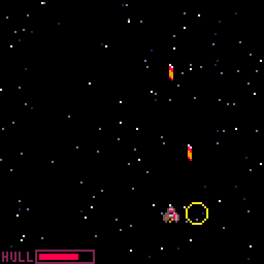
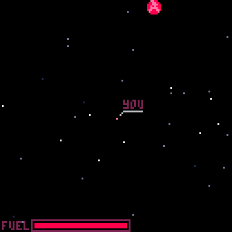

Howdy! This is my weekly post where I write about whatever programming-related stuff I got up to in the past week.

---

## Space Game for Pico-8

I began work this week on my first Pico-8 cart, which is simply called "Space Game" at the moment because I haven't had a flash of inspiration to call it anything else.

The gist of the game will be something of a variation on the games [Weird Worlds: Return to Infinite Space](https://store.steampowered.com/app/226120/Weird_Worlds_Return_to_Infinite_Space/) and [Reigns: Beyond](https://devolverdigital.com/games/reigns-beyond). I've been saying that it's a "space exploration [roguelike](https://en.wikipedia.org/wiki/Roguelike) with rpg elements". Let me explain...

The main part of the game will be an [overworld](https://en.wikipedia.org/wiki/Overworld) in the form of a star map. You'll have limited fuel to use to fly between planets (and space stations?) to refuel (and purchase or sell gear and supplies?). In the overworld, there'll be hazards and enemies (which fly at you to initiate combat, Earthbound style). When fighting or facing a hazard, the game will switch into a [SHMUP](https://en.wikipedia.org/wiki/Shoot_%27em_up) where you'll either fight a fleet of enemies, a single powerful boss-like enemy (or have to navigate an asteroid belt?).

If there's room in the cart (because pico-8 cartridges only allow a limited amount of code), after you defeat an enemy in the SHMUP mode, I want you to 'board' the enemy ship and fight the crew in an old school turn-based RPG sort of way (like Earthbound or Pokemon). I think this might be too ambitious so I'm not married to this idea just yet.

What's the actual goal of the game? I figure you'll be given an assignment at the beginning of the game, like "transport this item to this planet", and the planet will be very far away. It's up to you to get the item there, or maybe hawk it somewhere and do your own thing. In general, it should be fun to just fly around the galaxy, trying to get better gear and destroy bigger and badder pirates.

I started the game by downloading this [A Pico-8 Spaceshooter in 16 GIFs](https://www.lexaloffle.com/bbs/?tid=3948) project, since I figured the SHMUP part of this project was the most important thing to try to accomplish first. I didn't really need to follow the tutorial, I just grabbed the finished product and built my own SHMUP piece by piece, copying and pasting bits of code from it and adapting it as I went along.

It's nowhere near finished, but here's a little GIF of this mode in action. There's _a lot_ more work to be done.

Yesterday, I started to get bored working on the SHMUP mode, and decided to move onto the overworld. To learn how camera movement works I ended up using a cartridge I just happened to see shared on the pico-8 Discord called [An RPG Movement Template](https://gist.github.com/amiantos/f314878361e9cbe86a02da584c315cc1) and basically followed it similarly to the other file for the SHMUP. This one was much simpler though, as I really just needed to construct a 1024x1024 map and then have the camera follow a 'dot' that is your ship in the overworld.

After I got the camera moving, I tackled getting the background stars to parallax, which was a bit more complicated than in the SHMUP mode. In the SHMUP mode the camera itself doesn't move, the stars move relative to the ship. In this, the entire background moves and the stars need to 'resist' moving with the camera to some extent. It took a lot of experimentation but I got it into a good place.

After that, I wanted to start drawing some planets on screen. I whipped up a couple simple planet sprites, and then started looking for how to name them. I googled, "planet name generator" and found [this website](https://www.fantasynamegenerators.com/planet_names.php). I took a look in the source code for the site, and saw [the javascript used to generate names](https://www.fantasynamegenerators.com/scripts/planetNames.js?fdsd). It didn't take me long to swipe that logic and bake it into my cartridge.

I figure this wasn't bad to do, since the website has this down at the bottom: *You're free to use names on this site to name anything in any of your own works, assuming they aren't already trademarked by others of course.* So, what would the difference be between just grabbing a bunch of them in a list, and generating them directly in my project? Also, I'm giving them credit in the code.

Anyway, here's a GIF of what I have of the overworld so far.

And that's that for now...

I'm really enjoying this project. I was actually really intimidated by the idea of building a game for Pico-8, and figured I'd get discouraged or bored pretty early on and move on to something else. But this is actually a lot of fun, and it's not as hard as I thought it would be. If anything, the 8-bit nature makes it a bit easier, because I don't have to agonize over producing beautiful artwork. Takes a lot of the hard work out of it for me, as I am not much of an artist.

Over the next week I figure I'll get the hazards on the map. I'll have to figure out how to design the pirate overworld movement, which sounds like fun, and how to draw asteroid belts and the behavior around those. There's so much work to do, it's kind of hard to give a solid roadmap of what's coming up. And that's also one of the perks: there's so much to do, whenever I get bored of working on one part of it, I can move onto some other part of it.

---

That's it for me this week. See you next week!
